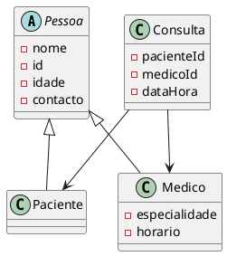
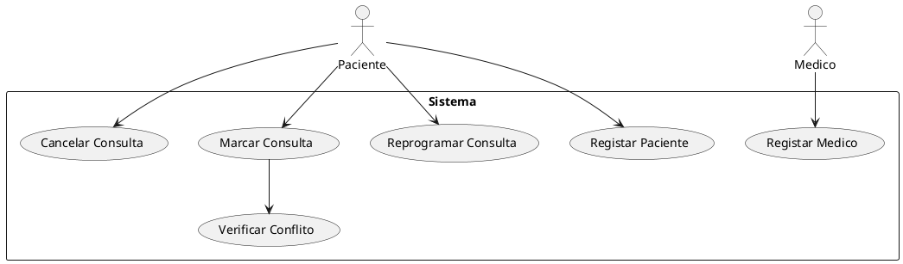

```markdown
# 🏥 Sistema de Gestão de Consultas Médicas

Projeto desenvolvido em Java para o trabalho final da disciplina de **Programação Orientada a Objetos** na Universidade do Mindelo.

## 📋 Funcionalidades Implementadas

- Cadastro de **Pacientes**  
  - Nome, ID, idade, contacto
- Cadastro de **Médicos**  
  - Nome, código, idade, contacto, especialidade, horário
- **Agendamento de Consultas**  
  - Associação de paciente e médico com data/hora
  - Verificação de conflitos de horário
- **Cancelamento/Reprogramação** de consultas
- Listagens de consultas:  
  - Por paciente  
  - Por médico
- **Persistência de dados** em ficheiros locais (`.dat`)

## 🛠️ Tecnologias e Conceitos Utilizados

- **Java 17+**
- **POO**: Encapsulamento, Herança, Polimorfismo, Abstração
- Serialização (armazenamento em ficheiros binários)

## 📦 Estrutura do Projeto

```

SistemaConsultas/
├── Main.java
├── models/
│   ├── Pessoa.java (abstrata)
│   ├── Paciente.java
│   ├── Medico.java
│   └── Consulta.java
├── services/
│   └── SistemaConsulta.java
└── storage/
└── FicheiroUtils.java

````

## 🚀 Como Executar

### Pré-requisitos:
- Java 17 ou superior
- Editor ou IDE (ex: VS Code, Eclipse)

### Passos:
```bash
javac Main.java models/*.java services/*.java storage/*.java
java Main
````

### Uso:

* O sistema funciona em modo terminal.
* Os dados são automaticamente salvos em ficheiros `.dat`.

## 📊 Diagramas UML (plantuml)

### Diagrama de Classes



### Diagrama de Casos de Uso



## 📌 Melhorias Futuras (opcional)

* Interface gráfica com JavaFX ou Swing
* Relatórios exportáveis (ex: PDF)
* Autenticação de utilizadores

---

**Desenvolvido por:** Elvin Pires
**Disciplina:** Programação Orientada a Objetos
**Universidade do Mindelo** – 2024/2025

```

---

Se quiseres, posso já adicionar este `README.md` dentro do projeto `.zip` e atualizar o link para download. Queres?
```
