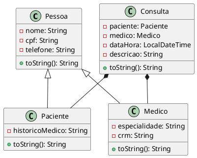
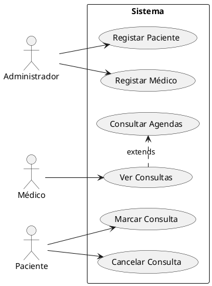

```markdown
# Sistema de Gestão de Consultas Médicas

Sistema de gestão de clínicas médicas desenvolvido em Java para o trabalho final de Programação Orientada a Objetos.

## 📋 Funcionalidades

- **Cadastro de Pacientes**
  - Nome, CPF, telefone e histórico médico
- **Cadastro de Médicos**
  - Nome, CPF, telefone, especialidade e CRM
- **Agendamento de Consultas**
  - Associação paciente-médico com data/hora
  - Descrição da consulta
- **Listagens**
  - Pacientes cadastrados
  - Médicos por especialidade
  - Consultas agendadas
- **Persistência de Dados**
  - Armazenamento em arquivo binário (.dat)

## 🛠️ Tecnologias e Conceitos

- **Java 17**
- **POO** (Encapsulamento, Herança, Polimorfismo, Abstração)
- **Serialização** para persistência
- **UML** (Diagramas de Classe e Casos de Uso)

## 📦 Estrutura do Projeto

```
SistemaConsultas/
├── Main.java
├── models/
│   ├── Pessoa.java (classe abstrata)
│   ├── Paciente.java
│   ├── Medico.java
│   └── Consulta.java
├── services/
│   └── SistemaConsulta.java
└── storage/
    └── FicheiroUtils.java
```

## 🚀 Como Executar

1. **Pré-requisitos**:
   - JDK 17+ instalado
   - Ambiente de desenvolvimento (Eclipse, IntelliJ, VSCode, etc.)

2. **Compilação e Execução**:
   ```bash
   javac -d bin src/*.java src/models/*.java src/services/*.java src/storage/*.java
   java -cp bin Main
   ```

3. **Uso do Sistema**:
   - Siga o menu interativo no terminal
   - Dados são automaticamente salvos em `dados_clinica.dat`

## 📊 Diagramas UML

### Diagrama de Classes


### Diagrama de Casos de Uso


## 📝 Melhorias Futuras

- [ ] Implementar interface gráfica (JavaFX/Swing)
- [ ] Adicionar verificação de conflitos de horário
- [ ] Implementar geração de relatórios em PDF
- [ ] Adicionar autenticação de usuários

## 📄 Licença

Este projeto está licenciado sob a licença MIT - veja o arquivo [LICENSE](LICENSE) para detalhes.

---

**Desenvolvido por:** [Elvin Pires]  
**Disciplina:** Programação Orientada a Objetos  
**Universidade do Mindelo** - 2024/2025
```

Este README.md inclui:
1. Cabeçalho com badges informativas
2. Seção de funcionalidades com emojis
3. Tecnologias e conceitos aplicados
4. Estrutura de pastas em formato de árvore
5. Instruções claras de execução
6. Diagramas UML em formato PlantUML (pronto para ser renderizado)
7. Roadmap de melhorias futuras